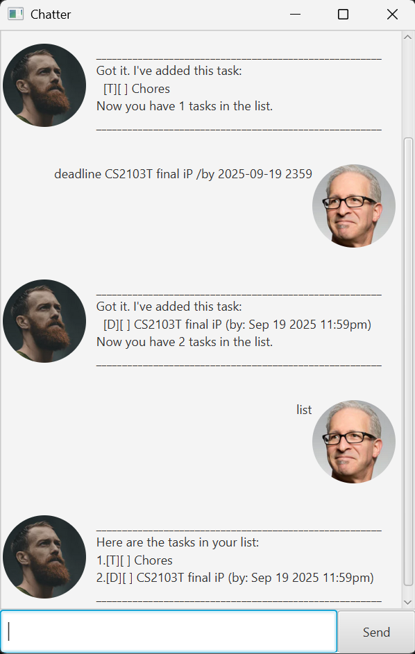

# Chatter User Guide



Chatter is an everyday helper that helps to keep track of different
kinds of tasks that you have! It can help to keep track of:
1. ToDo Tasks
2. Deadline Tasks
3. Event Tasks

## Features

Words that are bolded are standard inputs,
while those in [ ] are variable inputs which are
up to your needs.

Time inputs will always be in `yyyy-MM-dd HHmm` format,
**WITH THE EXCEPTION OF THE 'ON' COMMAND. WHICH WILL BE IN `yyyy-MM-dd` format**

### Adding ToDo task

This is to provide you a reminder on an everyday task,
no time concern whatsoever. Key in: **todo** [description]

Example: `todo Chores`

If command is valid, you should receive the following output,
signalling that you have added the ToDo task to the list.

```
Got it. I've added this task:
 [T][ ] Chores
Now you have 1 tasks in the list.
```

### Adding Deadline task

This is to provide you a reminder on a task with deadline.
Key in: **deadline** [description] **/by** [time]

Example: `deadline CS2101 Submission /by 2025-09-19 2359`

If command is valid, you should receive the following output,
signalling that you have added the Deadline task to the list.

```
Got it. I've added this task:
 [D][ ] CS2101 Submission (by: Sep 19 2025 11:59pm)
Now you have 2 tasks in the list.
```

### Adding Event task

This is to provide you a reminder on a task with both a start and end date.
Key in: **event** [description] **/from** [time] **/to** [time]

Example: `event Internship /from 2025-09-19 0800 /to 2025-12-19 1800`

If command is valid, you should receive the following output,
signalling that you have added the Event task to the list.

```
Got it. I've added this task:
 [E][ ] Internship (from: Sep 19 2025 8:00am to: Dec 19 2025 6:00pm)
Now you have 3 tasks in the list.
```

### Delete a task

When a task is obsolete, or you mistyped some information,
you can delete the task. Key in: **delete** [index of item]

Example: `delete 1`

If command is valid, you should receive the following output,
signalling that you have deleted the task from the list.

```
Noted. I've removed this task:
 [T][ ] Chores
Now you have 2 tasks in the list.
```

### Show list of current tasks

You can see the current list of all the tasks you have. Key in: **list**

Example: `list`

If command is valid, you should receive the following output,
signalling that you are viewing all the tasks in the list.

```
Here are the tasks in your list:
1.[D][ ] CS2101 Submission (by: Sep 19 2025 11:59pm)
2.[E][ ] Internship (from: Sep 19 2025 8:00am to: Dec 19 2025 6:00pm)
```

### Mark a task as done

If you are done with a task and wants to keep track of progress, you can mark the task as done.
Key in: **mark** [index of task]

Example: `mark 1`

If command is valid, you should receive the following output,
signalling that you have marked the specific task in the list as done.

```
Nice! I've marked this task as done:
 [D][X] CS2101 Submission (by: Sep 19 2025 11:59pm)
```

### Unmark a task as done

If you realise that a task previously marked as done actually still requires work,
or you accidentally marked the wrong task as done, you can unmark the task as done.
Key in: **unmark** [index of task]

Example: `unmark 1`

If command is valid, you should receive the following output,
signalling that you have unmarked the specific task in the list as done.

```
OK, I've unmarked this task:
 [D][ ] CS2101 Submission (by: Sep 19 2025 11:59pm)
```

### Find a task using keywords

If you want to find tasks in the list quickly using keywords.
Key in: **find** [keyword]

Example: `find CS2101`

If command is valid, you should receive the following output,
signalling that those are all the task in the list that matches the keyword.

```
Here are the matching tasks in your list:
1.[D][ ] CS2101 Submission (by: Sep 19 2025 11:59pm)
```

### Find task that still needs to be done on a day

If you want to figure out what tasks still needs to be done on a specific day,
maybe to see if you are able to make it for an outing on that day.
Key in: **on** [time] 

_Reminder that time will be in yyyy-MM-dd format._

Example: `on 2025-10-18`

If command is valid, you should receive the following output,
signalling that those are all the task in the list that still needs be done on that date.

```
Tasks occuring on Oct 18 2025:
[E][ ] Internship (from: Sep 19 2025 8:00am to: Dec 19 2025 6:00pm)
```

### Exit the program
Finally, after you are done using the program and want to close it. Key in: **bye**

Example: `bye`

If command is valid, you should receive the following output,
signalling that you have successfully closed the program.
The window will automatically close in 1 second. 

```
Bye. Hope to see you again soon!
```

This concludes all the features of Chatter. Try it for yourself now, it's **FREE**!

## Acknowledgements
AI was used in the following classes and its uses are:
- In Parser class to split the parse method into smaller methods.
- In Dialog and MainWindow class to change display pictures to circles.

